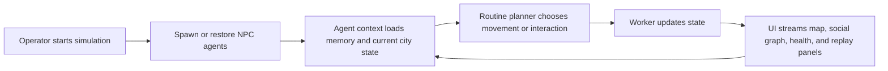
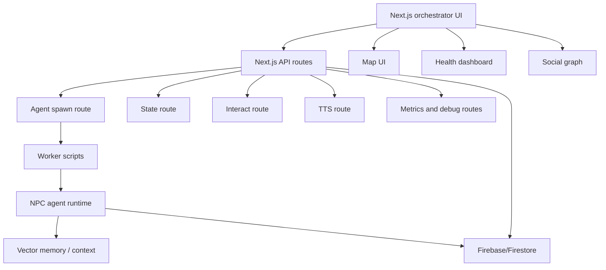
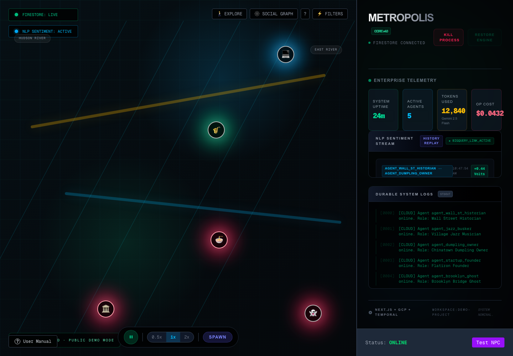
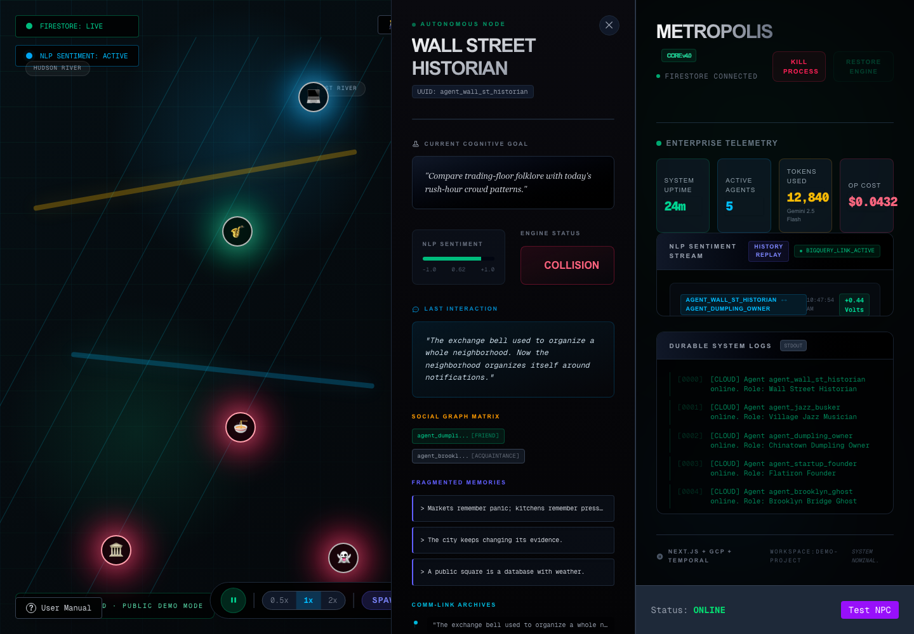
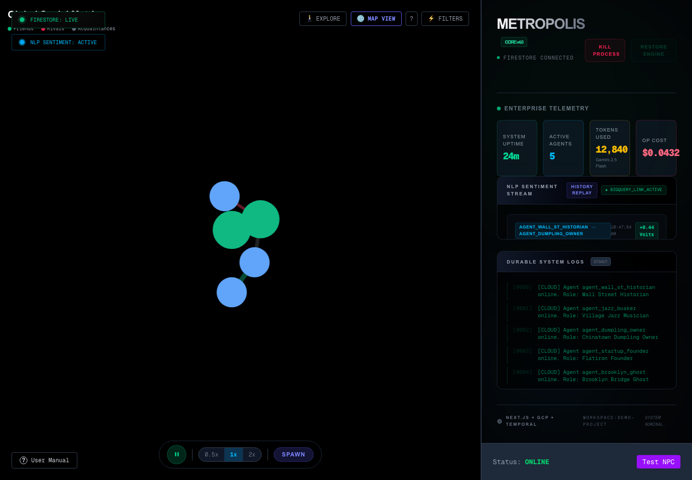
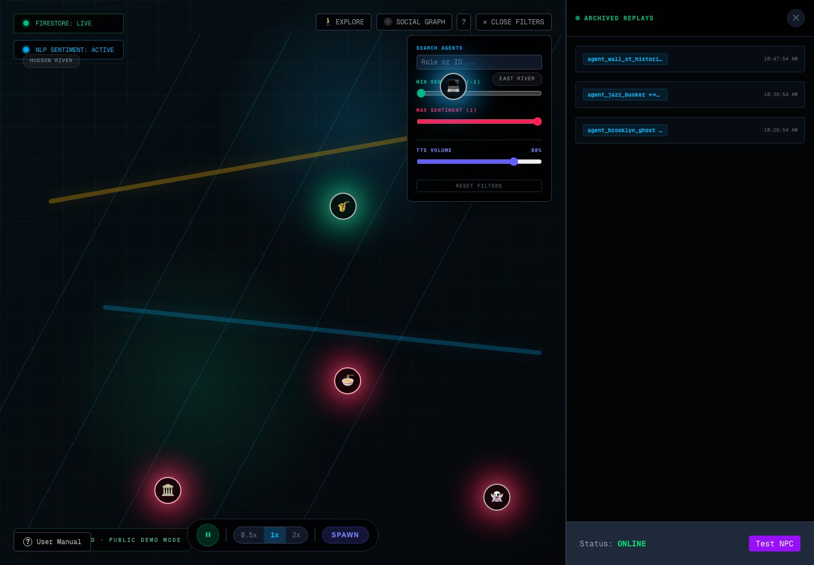

# Metropolis

Realtime autonomous NPC city simulation with persistent agents, cognition loops, social graph state, workflow workers, and a Next.js control surface.

Metropolis was built for the Gemini hackathon as an agentic city sandbox: agents spawn into a simulated map, maintain memory and social context, move through routines, and expose health/debug panels so the operator can inspect what the simulation is doing.

## Contents

- [At A Glance](#at-a-glance)
- [Simulation Loop](#simulation-loop)
- [Architecture](#architecture)
- [Feature Map](#feature-map)
- [Tech Stack](#tech-stack)
- [Repository Map](#repository-map)
- [Screenshot Gallery](#screenshot-gallery)
- [Run Locally](#run-locally)
- [Verification](#verification)
- [Operational Notes](#operational-notes)
- [Status](#status)
- [License](#license)

## At A Glance

| Area | Details |
|---|---|
| Product | Autonomous NPC simulation engine |
| Users | Builders exploring city-scale agent state, memory, and interactions |
| Core value | Spawn agents, move them through routines, inspect health, replay encounters, and stream simulation state |
| UI | Next.js orchestrator app |
| Workers | Node workers and workflow scripts |
| State | Firebase/Firestore integration and local demo fixtures |
| Hackathon stack | Gemini model integration, LangGraph-style cognition, vector memory, Temporal-style workflow concepts |

## Simulation Loop



## Architecture



## Feature Map

| Feature | Evidence in repo |
|---|---|
| Map simulation UI | `orchestrator/src/components/MapUI.tsx` |
| Agent controls | `orchestrator/src/components/SimControls.tsx`, `ControlPanel.tsx` |
| Health/debug panels | `HealthDashboard.tsx`, `DebugPanel.tsx` |
| Social graph | `SocialGraph.tsx`, `/api/social-graph` |
| Encounter replay | `EncounterReplay.tsx`, `/api/encounters/history` |
| Agent spawn API | `orchestrator/src/app/api/agents/spawn/route.ts` |
| Worker scripts | `worker.js`, `spawn-agents.js`, `workflows.js` |
| Demo docs | `DEMO_WALKTHROUGH.md`, `docs/SPRINT_PLAN.md` |

## Tech Stack

| Layer | Technology |
|---|---|
| UI | Next.js, React, TypeScript |
| Runtime | Node.js workers |
| State | Firebase/Firestore |
| Agent workflow | Worker scripts, cognition/context modules |
| Observability | Health routes, metrics route, debug panel |
| Tests | API contract and stream tests |
| Deployment | Docker worker images, Docker Compose |

## Repository Map

```text
orchestrator/    Next.js UI and API routes
scripts/         Smoke, handoff, grounding, and BigQuery streamer scripts
worker.js        Main worker entry
npc_agent.js     NPC runtime entry
workflows.js     Workflow orchestration helpers
docs/            Sprint and demo documentation
```

## Screenshot Gallery

| Image | Caption |
|---|---|
|  | Public demo mission-control surface with active agents, encounter stream, durable logs, telemetry cards, and simulation controls. |
|  | Agent intelligence panel showing role, location snapshot, cognitive goal, sentiment, engine status, last interaction, and comm-link input. |
|  | Social graph mode with live agent nodes and relationship edges for inspecting interactions outside the map view. |
|  | Operator filter panel for searching agents, sentiment thresholds, and TTS volume while the simulation remains visible. |
|  | Archived replay drawer showing prior encounters and transcripts alongside the active city-grid view. |

These captures were taken from the local orchestrator with `METROPOLIS_PUBLIC_DEMO=true` and `NEXT_PUBLIC_METROPOLIS_PUBLIC_DEMO=true` so the UI can be documented without a Clerk session or cloud credentials. When a Google Maps key is absent, the public demo uses the offline NYC grid view shown above.

## Run Locally

Install and build the orchestrator:

```bash
cd orchestrator
npm ci
npm run build
npm run dev -- -p 3120
```

Open `http://localhost:3120`.

For the full Docker Compose stack:

```bash
DEMO_MODE=true docker compose up --build
```

The full stack expects local `.env` / Firebase / GCP credentials. Without them, the UI can render but Firestore-backed panels use the fallback `demo-project` and return permission/API-disabled errors.

For worker-level development:

```bash
npm install
npm run worker
npm run spawn
```

## Verification

Current verification findings with Node `v25.3.0` and npm `11.7.0`:

| Check | Result |
|---|---|
| `npm ci --dry-run --ignore-scripts` at repo root | Passed; root lockfile resolves |
| `npm ci` at repo root | Passed; added 446 packages and audited 447 packages. npm reported deprecated `node-domexception` / `glob` warnings and 28 audit findings |
| `cd orchestrator && npm ci --dry-run --ignore-scripts` | Passed; orchestrator lockfile resolves |
| `cd orchestrator && npm ci` | Passed after moving stale generated `orchestrator/node_modules` aside; added 874 packages and audited 875 packages |
| `cd orchestrator && npm test` | Passed: 21 tests across 2 files |
| `cd orchestrator && npm run build` | Passed; warnings remain for multiple lockfiles, deprecated middleware convention, missing root `.env`, and empty Firebase Admin fallback during build |
| `cd orchestrator && npm run lint` | Passed with 0 errors and 3 existing `MapUI` hook-dependency warnings |
| Screenshot link | `docs/screenshots/orchestrator-localhost-3120.png` exists and is linked from this README |

## Operational Notes

- Keep provider keys, Firebase credentials, and webhook secrets out of git.
- Use demo fixtures when presenting the project publicly.
- Treat generated issue files and sprint notes as supporting artifacts, not the main product story.

## Status

Root install, orchestrator install, lint, tests, build, and local UI screenshot capture are verified. Remaining cleanup is limited to dependency audit findings reported by npm and the non-failing `MapUI` hook-dependency warnings.

## License

MIT. See [LICENSE](LICENSE).
