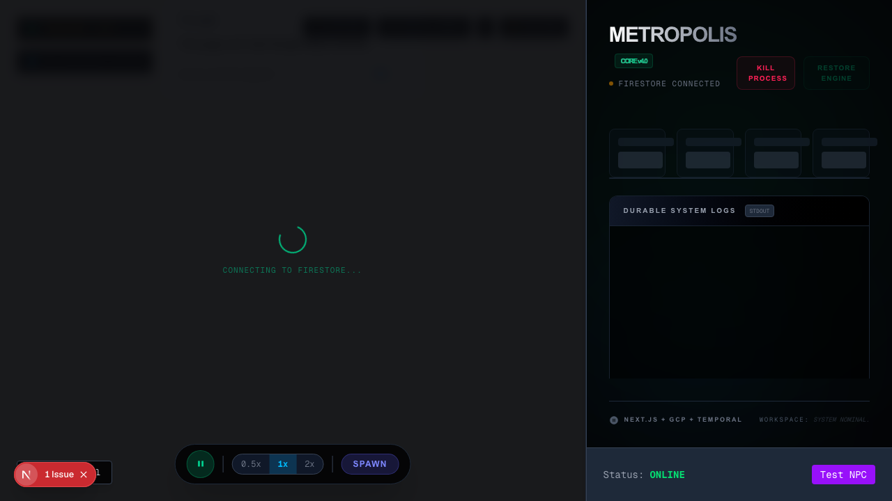

# Metropolis Orchestrator

Next.js control surface and API layer for the Metropolis NPC simulation.

## Run

```bash
npm ci
npm run dev -- -p 3120
```

Open `http://localhost:3120`.

The UI can render without local provider credentials, but Firestore-backed panels will use the fallback `demo-project` admin app and can return Firestore permission or API-disabled errors. For a live simulation, provide the Firebase, Gemini, Google Maps, and GCP credentials expected by the root `.env` / `orchestrator/.env.local` files.

## Build And Test

```bash
npm ci
npm test
npm run build
```

Verified in this pass:

| Check | Result |
|---|---|
| `npm ci --dry-run --ignore-scripts` | Passed; lockfile resolves |
| `npm ci` | Passed after moving stale generated `node_modules` aside |
| `npm test` | Passed: 21 tests across 2 files |
| `npm run build` | Passed; warnings remain for multiple lockfiles, deprecated middleware convention, missing root `.env`, and empty Firebase Admin fallback during build |
| `npm run lint` | Passed with 0 errors and 3 existing `MapUI` hook-dependency warnings |

Local UI screenshot from this run:


